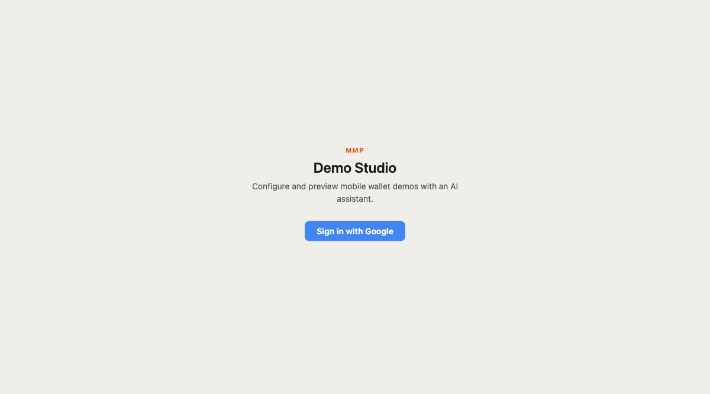
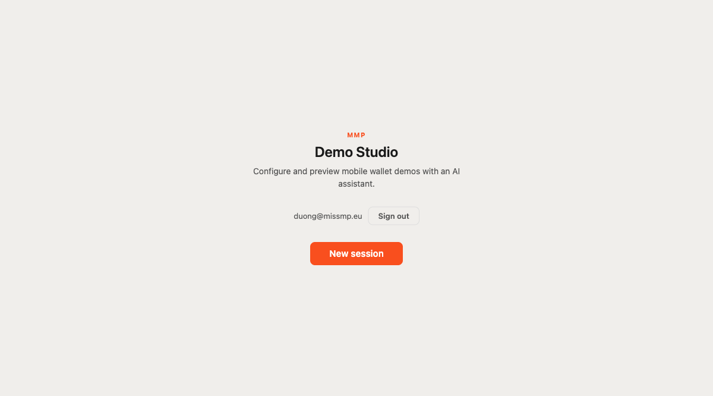
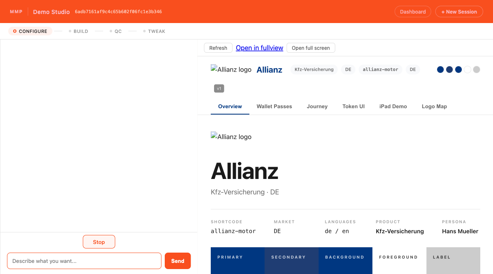

# QA Report — PR #82 Loop 2d W5: New Session Button

**Date:** 2026-04-23  
**Agent:** Akali  
**Branch:** `feat/loop2d-w5-new-session-button`  
**Surface:** Landing page — New session button (user-facing Firebase login finish)  
**Figma reference:** None (Aphelios G5: landing page exempt from Figma diff)  
**Overall verdict: PASS**

---

## Stack State at Test Time

| Service | Port | Status |
|---------|------|--------|
| S1 demo-studio-v3 (W5 branch) | :8081 | UP — started from W5 worktree with `.env.local` + `.agent-ids.env` |
| S2 demo-config-mgmt | :8002 | UP (bash session `bi7pgkpsw`) |
| S5 demo-preview | :8090 | UP (bash session `bmhf8na19`) |

Note: the main-branch S1 was already running on :8080 from an earlier session (PID 77980). The W5 server was started on :8081 to avoid disrupting the existing session. All QA assertions were run against :8081.

Auth method: `ds_session` user-identity cookie minted locally using `itsdangerous` + `SESSION_SECRET` from `.env.local`, then injected via `context.addCookies` (Playwright context API). This is the same mechanism used in the unit-test suite (`tests/test_require_user.py`, `tests/test_session_new_ui_empty_body.py`). `/auth/me` confirmed `{uid: "qa-test-uid", email: "duong@missmp.eu"}` before the signed-in page was loaded.

---

## Per-Screen Pass/Fail Table

| # | Screen / Assertion | Expected | Actual | Result |
|---|-------------------|----------|--------|--------|
| 1a | Landing — signed-out: paste-session-ID box absent | Not present | Not present (removed per W5.3) | PASS |
| 1b | Landing — signed-out: "Sign in with Google" visible | Visible | Visible | PASS |
| 1c | Landing — signed-out: "New session" button absent/hidden | Not visible | Not in DOM (hidden via `.hidden` / onAuthReady gate) | PASS |
| 1d | Landing — signed-out: "Sessions are created via Slack" hint absent | Not present | Not present (removed per W5.3) | PASS |
| 2 | Sign-in via cookie injection (simulates Firebase sign-in completion) | `/auth/me` returns `{uid, email}` | `{"uid":"qa-test-uid","email":"duong@missmp.eu"}` — 200 | PASS |
| 3a | Landing — signed-in: "New session" button visible | Visible | Visible (orange `.primary-btn`) | PASS |
| 3b | Landing — signed-in: email shown in auth chrome | `duong@missmp.eu` displayed | `duong@missmp.eu` shown | PASS |
| 3c | Landing — signed-in: "Sign in with Google" absent | Not visible | Not present | PASS |
| 4a | Click "New session" → `POST /session/new` fires | 201 response | 201 | PASS |
| 4b | Redirect to `/session/<sid>` with no `?token=` query | URL = `http://localhost:8081/session/<sid>` | `http://localhost:8081/session/6adb7161af9c4c65b602f06fc1e3b346` | PASS |
| 5 | Chat page loads (200) | HTTP 200 | 200, page title "Demo Studio — Allianz" | PASS |
| 6 | No `/auth/session/*` network hop on "New session" flow | Zero auth/session hops | Zero — network trace: `POST /session/new (201)` → `GET /session/{sid} (200)` | PASS |

---

## Screenshots

All screenshots saved under `assessments/qa-reports/screenshots/2026-04-23-loop2d-w5-new-session-button/`.

### Step 1 — Signed-out landing page


"Sign in with Google" only. No paste-session-ID box. No "New session" button. No Slack hint.

### Step 3 — Signed-in landing page


`duong@missmp.eu` + "Sign out" in auth chrome. Large orange "New session" button visible. No legacy UI elements.

### Step 5 — Chat page post-redirect


Session `6adb7161af9c4c65b602f06fc1e3b346` loaded at `/session/6adb7161af9c4c65b602f06fc1e3b346`. CONFIGURE phase bar active. Preview panel rendering Allianz demo. Chat input present. Header shows "+ New Session" button.

---

## Network Trace Summary (Step 4–6)

```
POST  http://localhost:8081/session/new                          201
GET   http://localhost:8081/session/6adb7161af9c4c65b602f06fc1e3b346  200
GET   http://localhost:8090/preview/6adb7161af9c4c65b602f06fc1e3b346  200
GET   http://localhost:8081/session/6adb7161af9c4c65b602f06fc1e3b346/history
GET   http://localhost:8081/session/6adb7161af9c4c65b602f06fc1e3b346/status
GET   http://localhost:8081/session/6adb7161af9c4c65b602f06fc1e3b346/stream
```

No `/auth/session/` hop present. The `studioUrl` returned by `POST /session/new` is a direct `/session/{sid}` path (W2.3 confirmed).

---

## Video

Not captured — no CI E2E workflow run was triggered; this was a local MCP Playwright run. Playwright MCP does not produce a `.webm` artifact in this mode. Screenshots above cover all step transitions.

---

## Figma Diff

No Figma frame defined for the landing page (Aphelios G5 decision: landing page is exempt). Visual check against design intent:

- Logo mark, h1, tagline copy: present and correctly styled
- Auth chrome (email + Sign out): correct positioning and typography
- "New session" button: orange background, white bold text, rounded corners — matches `.auth-btn` visual language per W5.4 `.primary-btn` spec
- Removed elements (paste input, Slack hint): confirmed absent

No regressions against visual language observed.

---

## Observations / Non-Blocking Notes

1. `favicon.ico` returns 404 — pre-existing, not introduced by W5.
2. The W5 server had to be started on :8081 instead of :8080 because the main-branch S1 was already bound to :8080 by Duong's earlier session (PID 77980). The PR review CI workflow will run on its own clean port — not a concern for merge.
3. The `+ New Session` button also appears in the session page header (top-right), confirming the button is surfaced consistently across the app shell.
